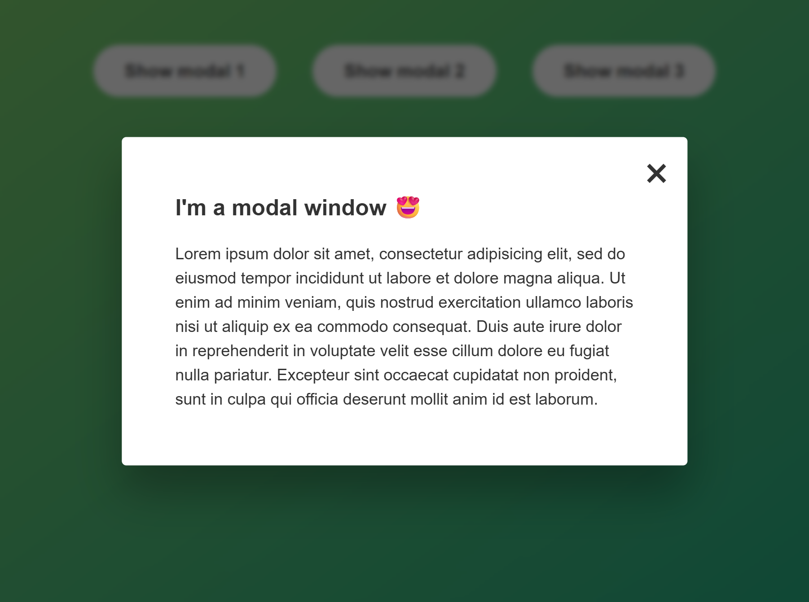

# Modal Window

A simple Modal Window project built with HTML, CSS, and JavaScript DOM manipulation.

## About

This project demonstrates a simple interactive modal window that can be opened and closed through different user interactions.

## Live Demo

[View Live Demo](https://foysaliio.github.io/Modal-Window/)

## Screenshot



## Features

• Open the modal by clicking the Open button
• Close the modal using the close button
• Close the modal by clicking outside the modal
• Close the modal by pressing the Escape key

## Technologies Used

• HTML5
• CSS3
• JavaScript
• DOM Manipulation

## What I Practiced

• DOM selection
• Event listeners
• Click events
• Keyboard events
• Event target
• Class manipulation
• Showing and hiding elements
• Handling user interactions

## Project Structure

```text
Modal Window/
│
├── index.html
├── style.css
├── script.js
└── README.md
```
